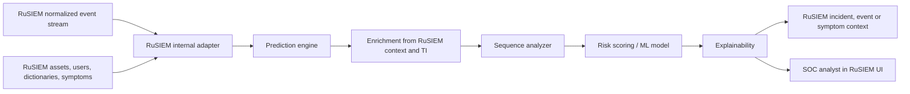

# Архитектура внутреннего модуля RuSIEM

## Поток обработки

## Компоненты прототипа

- `app/main.py` - HTTP API.
- `app/rusiem_internal.py` - граница зависимости от RuSIEM: внутренний контракт,
  контекст системы и формат результата для возврата в RuSIEM.
- `app/syslog_server.py` - UDP syslog listener.
- `app/normalizer.py` - приведение событий к единой схеме.
- `app/enrichment.py` - обогащение контекстом, сейчас с безопасными заглушками.
- `app/sequence.py` - анализ последовательностей в скользящем окне.
- `app/scoring.py` - объяснимый rule-based risk score.
- `app/pipeline.py` - единый конвейер обработки.

## Основной runtime-контур

В промышленной версии модуль должен запускаться как системный компонент RuSIEM
или как тесно связанный микросервис в контуре RuSIEM. Он не должен требовать от
заказчика отдельной внешней интеграционной шины для основной функции.

Основные зависимости от RuSIEM:

- поток нормализованных событий;
- справочники и поля событий;
- активы и критичность активов;
- пользователи, роли и tenant-контекст;
- симптомы и правила корреляции;
- API создания/обогащения инцидентов;
- штатный механизм обновления и мониторинга микросервисов.

## Контракт результата

Результат прогноза содержит:

- `prediction_id`
- `event_id`
- `probability`
- `risk_score`
- `risk_level`
- `threat_class`
- `confidence`
- `explanations`
- `recommendations`
- `normalized_event`
- `enrichment`

## Развитие до промышленной версии

1. Заменить in-memory store на Kafka/RabbitMQ + PostgreSQL/ClickHouse.
2. Подключить MaxMind GeoIP, RDAP/WHOIS и TI-провайдеры.
3. Добавить feature store для признаков по пользователю, активу, IP и tenant.
4. Ввести ML-модель:
   - baseline: gradient boosting / logistic regression;
   - sequence model: HMM, LSTM/Transformer или temporal graph scoring;
   - anomaly detection: isolation forest / autoencoder.
5. Добавить feedback loop от аналитиков SOC для дообучения.
