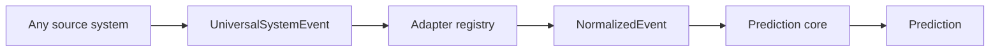

# Universal Prediction System

The project now supports two layers:

- prediction core: normalization, enrichment, sequence analysis, scoring and explanations;
- system adapters: small boundary modules that convert events from any source system to the shared `NormalizedEvent` schema.

## Flow



## Universal endpoint

`POST /api/v1/systems/events`

Example for a security system:

```json
{
  "system_id": "custom-iam",
  "system_type": "security",
  "event_type": "login_failed",
  "actor": "sidorov",
  "object_id": "vpn-gateway-01",
  "source_address": "203.0.113.10",
  "severity": "high",
  "attributes": {
    "tenant.id": "tenant-2"
  }
}
```

Example for an operations system:

```json
{
  "system_id": "k8s-prod",
  "system_type": "ops",
  "event_type": "cpu_spike",
  "object_id": "api-node-01",
  "severity": "medium",
  "metrics": {
    "cpu_percent": 97.5
  }
}
```

Supported adapters can be listed with `GET /api/v1/systems/adapters`.

To add a new system type, implement `SystemAdapter` in `app/adapters.py` and register it in `AdapterRegistry`.
